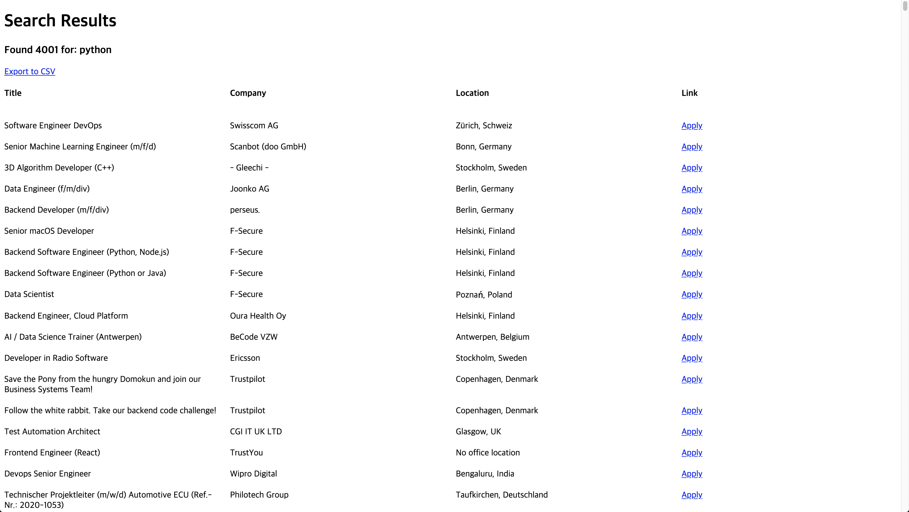

# web-scraper-flask
> Scrapping the job you want in stackoverflow and Download it as a .csv file

![Python Version][python-image]
![Flask Version][flask-image]

## Feature
- [x] Scraping the job you want!
- [x] Download it as .csv file!

[python-image]: https://img.shields.io/badge/python-v3.8-blue
[flask-image]: https://img.shields.io/badge/Flask-v1.1.2-yellowgreen